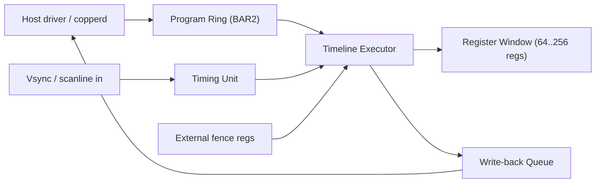

# fpga-copper

**Hardware Copper timeline engine for CopperlineOS (Phase‑1+).**  
`fpga-copper` implements the Copper‑2.0 idea in **RTL**: a tiny, deterministic timeline processor that executes frame‑synchronous programs (WAIT/MOVE/ADD/IRQ/LOOP/JUMP/FENCE) with **hardware timing** and **DMA**. It’s designed as a mezzanine/PCIe/M.2 card or SoC IP block that offloads the software `copperd` daemon.

> TL;DR: the classic Amiga “Copper,” modernized in silicon: run tiny display‑time programs *next to the scanout*, write layer registers at precise moments, and signal events with microsecond accuracy.

---

## Goals

- **Deterministic timing:** sub‑scanline scheduling (line/µs), vsync‑locked.  
- **Low host overhead:** command ring + DMA write‑back; few MMIO pokes per frame.  
- **Tiny footprint:** fits in modest FPGAs (ECP5‑85, Artix‑7 100T).  
- **Portable bus:** PCIe endpoint (AXI/AXI‑Lite internally), also **Wishbone**/simple AXI variants for SoCs.  
- **Safety:** bounds‑checked register writes, capability masks, and watchdogs.

Non‑goals (for now): 3D, full 2D blit (that’s `fpga-blitter`).

---

## Architecture



<details>
<summary>Text-only fallback (if Mermaid fails)</summary>

```
Host driver / copperd  ->  Program Ring (BAR2)  ->  Timeline Executor
                               ^                           |
                               |                           v
                           DMA write                 Register Window
                                                        and
                                                      Write-back
                                                          |
                                                          v
                                                   Host (DMA read)

Vsync / scanline in  ->  Timing Unit  ->  Timeline Executor
External fence regs  ----------------->  Timeline Executor
```
</details>

**Blocks**  
- **Program Ring**: host‑owned circular buffer of 64‑bit ops (cache‑coherent DMA).  
- **Executor**: single‑issue micro‑engine with label cache and loop counter.  
- **Timing Unit**: 64‑bit µs counter + vsync/line detector; optional genlock to KMS.  
- **Register Window**: small HW register file the executor can `MOVE/ADD`; mirrored to host or proxied to `compositord`.  
- **Write‑back Queue**: DMA ring for IRQ/events & optional “reg write” mirroring.  
- **Fence Registers**: timeline values written by host/GPU fences.

---

## Interfaces

- **PCIe** x1/x2 Gen2+ (or AXI‑Lite slave for SoC).  
- **BAR0 (MMIO)**: control/status + small CSRs.  
- **BAR1 (WB DMA)**: write‑back (device→host) ring.  
- **BAR2 (PR DMA)**: program (host→device) ring.  
- **SYNC pins**: optional vsync/hsync/line tick input; or **KMS‑provided timestamps** via MMIO.

### BAR0 (MMIO CSR map, draft)

| Offset | Name | R/W | Description |
|---:|---|:--:|---|
| 0x000 | `ID` | R | 32‑bit magic `0x43_4F_50_52` ("COPR") |
| 0x004 | `VER` | R | Major/minor |
| 0x008 | `CTRL` | RW | `EN`, `RESET`, `CLK_SRC={ext,mono}` |
| 0x00C | `STATUS` | R | `RUN`, `VSYNC_LOCK`, `ERR_*` |
| 0x010 | `TIME_US_LO` | R | 64‑bit monotonic µs, low |
| 0x014 | `TIME_US_HI` | R | 64‑bit monotonic µs, high |
| 0x018 | `VSYNC_CNT` | R | vsync counter |
| 0x020 | `PR_HEAD` | RW | producer index (host) |
| 0x024 | `PR_TAIL` | R | consumer index (device) |
| 0x028 | `WB_HEAD` | R | producer (device) |
| 0x02C | `WB_TAIL` | RW | consumer (host) |
| 0x030 | `IRQ_MASK` | RW | event mask |
| 0x034 | `IRQ_STATUS` | R/W1C | event flags |
| 0x040 | `FENCE_VK` | RW | external timeline value (e.g., Vulkan) |
| 0x100.. | `REG[n]` | RW | register window (`layer[0..N].*` via mapping) |

*(Indices for PR/WB are in **entries**, not bytes.)*

---

## Command set (binary on‑wire)

Each program entry is **64 bits**:

```
63          56 55               40 39                24 23                 0
+--------------+-------------------+-------------------+--------------------+
|   OPCODE     |        A          |         B         |         C          |
+--------------+-------------------+-------------------+--------------------+
```

**OPCODES (draft)**

| Opcode | Name | A | B | C | Description |
|---|---|---|---|---|---|
| 0x00 | `NOP` | ‑ | ‑ | ‑ | No‑op |
| 0x01 | `WAIT_VSYNC` | count | ‑ | ‑ | Wait N vsyncs (N≥1) |
| 0x02 | `WAIT_US` | us_hi | us_lo | ‑ | Wait N microseconds |
| 0x03 | `MOVE` | reg | value_hi | value_lo | `REG[reg]=value` |
| 0x04 | `ADD` | reg | delta_hi | delta_lo | `REG[reg]+=delta` |
| 0x05 | `IRQ` | tag_hi | tag_lo | ‑ | Emit tagged event |
| 0x06 | `JUMP` | label | ‑ | ‑ | Jump to label (index) |
| 0x07 | `LOOP` | count | label | ‑ | Decrement & jump while >0 (`0xFFFF_FFFF` = inf) |
| 0x08 | `FENCE_GE` | timeline | value_hi | value_lo | Stall until `FENCE[timeline] ≥ value` |
| 0x09 | `LABEL` | id | ‑ | ‑ | Marker (resolved on load; may be stripped) |
| 0x0A | `BIND` | reg_base | surface_id | flags | Optional: fast bind to pre‑declared target |

Notes:
- 24‑bit fields for `reg`/`label`; 48‑bit immediates for values (sign‑extended where relevant).  
- Host‑side loader resolves `LABEL` to indices (can remove them).  
- Alternate 128‑bit encoding is available behind a feature flag for wide immediates.

**Register mapping (example)**

`REG[0..]` is a contiguous window; the **host maps logical names** (`layer[n].x/y/alpha/z/visible`) to indices in user space. Hardware need not know layer semantics—just ensures atomic latch on vsync.

---

## Events (write‑back ring)

Device writes compact events to **WB** ring and raises MSI/MSI‑X (or legacy INTx).

| Type | Fields |
|---|---|
| `IRQ` | `tag`, `time_us` |
| `STATE` | `RUNNING/STOPPED/ERROR`, `code` |
| `VSYNC` | `vsync_cnt`, `time_us` |

Host (`copperd`) can forward/merge these into the user‑visible ports stream.

---

## Timing & latching

- Writes to `REG[n]` **shadow** and **latch on vsync** (one latch per output).  
- `WAIT_US` is driven by a 64‑bit microsecond counter derived from either:  
  - **External vsync** (genlocked: count resets at vsync, line tick optional), or  
  - **Monotonic PLL** if no external sync is provided.  
- **Jitter target:** `±100 µs` on `WAIT_US` at 60 Hz; better on SoC clocks.

---

## Build & simulate

### Prereqs

- **Verilator** (simulation) or **GHDL** (VHDL path).  
- **cocotb** (Python testbench) optional but recommended.  
- **FuseSoC**/**Edalize** or plain vendor tools (Yosys/nextpnr for ECP5; Vivado for Artix‑7).

### Layout

```
fpga-copper/
├─ rtl/
│  ├─ top/                 # bus wrappers (PCIe/AXI/Wishbone)
│  ├─ core/                # executor, timers, rings
│  └─ util/                # FIFOs, CDC, arbiters
├─ sim/
│  ├─ tb_copper_top.sv     # testbench
│  ├─ cocotb/              # python tests
│  └─ traces/              # wave dumps
├─ synth/
│  ├─ ecp5/                # Lattice ECP5 builds (yosys/nextpnr)
│  ├─ artix7/              # Xilinx Vivado projects
│  └─ kintex7/             # optional
├─ sw/
│  ├─ driver/              # Linux kernel driver stub (PCIe)
│  └─ user/                # lib + examples (ring setup, stress)
└─ README.md
```

### Sim (Verilator quickstart)

```bash
make -C sim verilate run   # builds and runs basic WAIT/MOVE loop
# View VCD/FSDB in gtkwave: sim/traces/copper.vcd
```

### Synthesis (ECP5 example)

```bash
# Requires yosys + nextpnr-ecp5 + ecppack
make -C synth/ecp5 BOARD=ulx3s85f
# Bitstream: build/ecp5/copper.bit
```

---

## Driver model (Linux, draft)

A tiny out‑of‑tree driver (later upstream) exposes:

- `/dev/copperline-copr0` (char dev) with `ioctl`s: map BARs, set up rings, subscribe MSI, feed fences.  
- `sysfs` attributes for version/health.  
- udev rule tags device to group `copperline` (no root needed for use).

Userspace: `copperd` switches from JSON execution to **ring producer**: it compiles JSON → binary ops, writes to PR, reads WB events, and forwards them to the normal ports API.

---

## Performance targets (first pass)

- **Program cache**: 1–2 KiB of labels/pcs.  
- **Clock**: 100–150 MHz on ECP5‑85; 150–250 MHz on Artix‑7 100T.  
- **Throughput**: ≥1 op/clk steady‑state; `WAIT_*` consumes cycles until satisfied.  
- **Vsync latency**: latch within ≤1 line of vsync edge (with ext sync).

---

## Security & safety

- **Capability mask** per program limits which `REG[n]` ranges can be written.  
- **Watchdog** aborts long busy‑waits; `LOOP` max iterations configurable.  
- **Bounds checks** on ring indices; CRC32 on ring headers (optional).

---

## Roadmap

- **v0.1**: core executor, PR/WB rings, WAIT/MOVE/ADD/JUMP/LOOP/IRQ, vsync in, PCIe BARs.  
- **v0.2**: FENCE support, capability masks, MSI‑X, improved CDC.  
- **v0.3**: Scanline tick mode, genlock helpers, self‑test, Linux driver PoC.  
- **v0.4**: Power/area optimizations, formal proofs on FIFOs/arbiters, SoC AXI‑Lite IP.

RFCs & detailed specs will live in [`CopperlineOS/rfcs`](https://github.com/CopperlineOS/rfcs) and `CopperlineOS/docs`.

---

## Contributing

- RTL style: one module = one file; explicit resets; CDC via 2‑FF sync or async FIFO.  
- Tests: add cocotb tests for each opcode and corner case (wrap, long waits, mask denials).  
- Keep vendor constraints minimal and portable; prefer open tools where possible.

See `CONTRIBUTING.md` and `CODE_OF_CONDUCT.md`.

---

## License

RTL and docs are licensed under **Apache‑2.0 OR MIT** (choose either).

---

## See also

- [`fpga-blitter`](https://github.com/CopperlineOS/fpga-blitter) — 2D DMA engine  
- Software: [`copperd`](https://github.com/CopperlineOS/copperd) · [`compositord`](https://github.com/CopperlineOS/compositord)  
- Protocol: [`ports`](https://github.com/CopperlineOS/ports) · Docs: [`docs`](https://github.com/CopperlineOS/docs)
